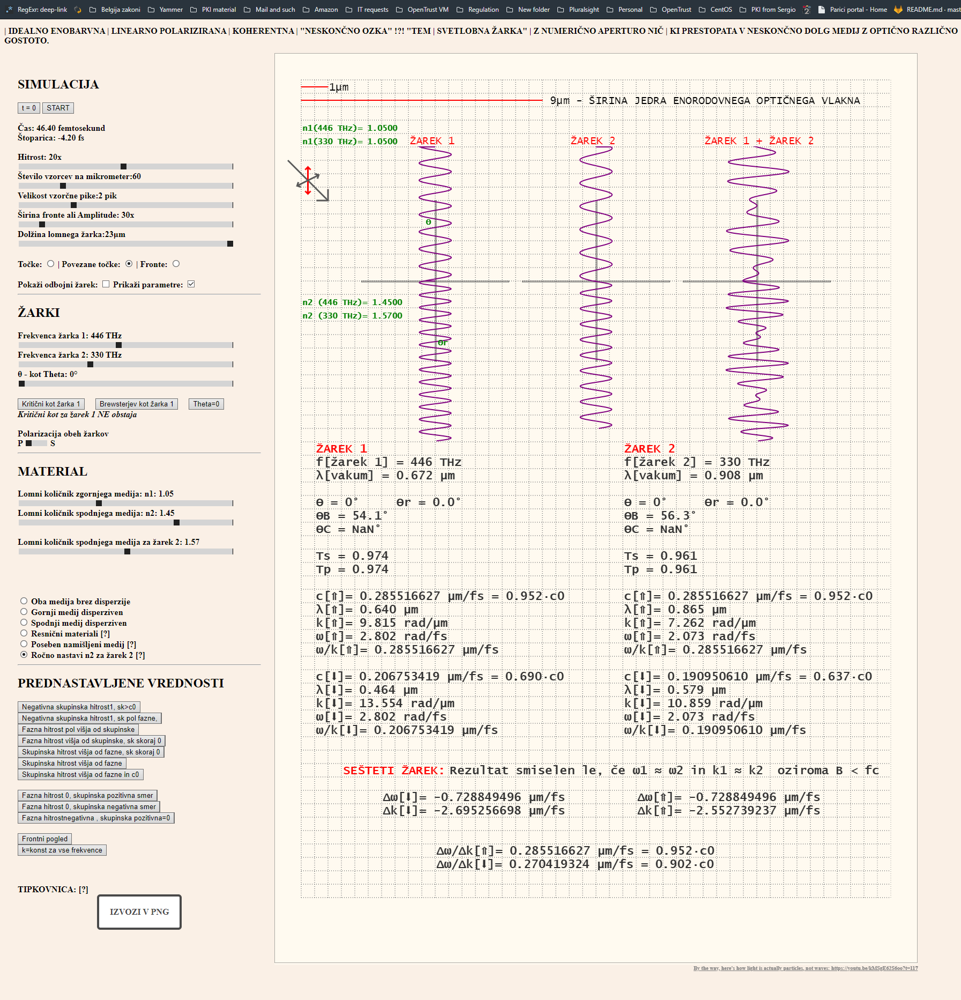
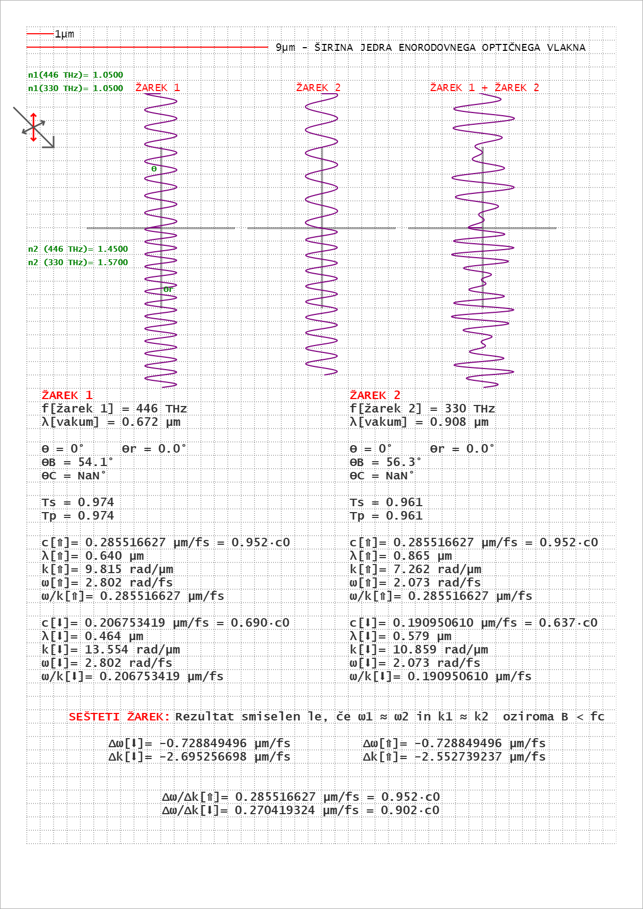
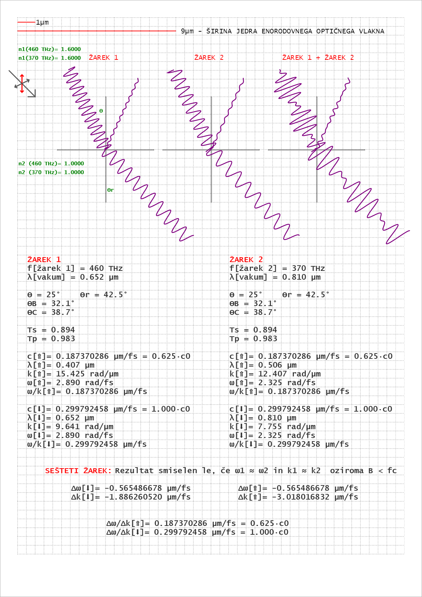
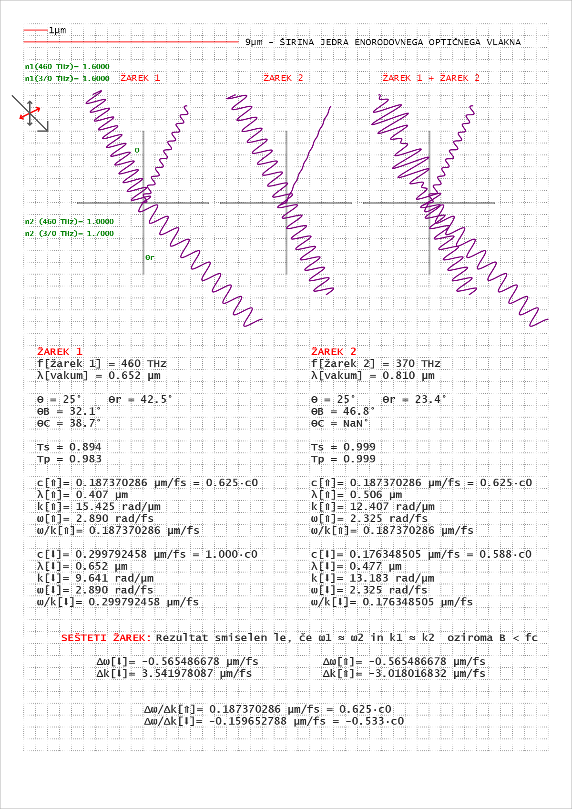

# EMWaves

## Simple Electromagnetic Wave Simulator - animated

This is a one-file-only HTML/Javascript(pure)/CSS simulator of light. It is capable of simulating some simple wave propeties and calculate basic parameters.

First version still requires heavy testing beacuse Javascript has some floating-poing strangeness and tends to mess up calculations entierly.

It's purpose was for me to try visualizing negative group velocity and I no longer have access to Matlab, so I built my own. 

Works best in Opera and Chrome and new chromium based E, has some performacne issues with Mozilla. 

Needa a kinda-powerful computer to run this as code isn't optimizied for performance. The pause stop stops the signal, but it does not stop the simulation. 

Reducing speed will not make it easier for the PC, reducing sample size however - will.

- code looks nicer in Notepad++

