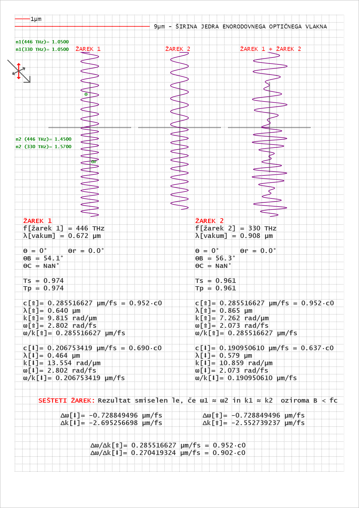

# EMWaves

## Electromagnetic Wave Simulator

This is a one-file only HTML/Javascript (pure)/CSS simulator of visible light. It's capable of simulating some simple signal propeties.
I's purpose was to try visuakiting negative group velocity.

